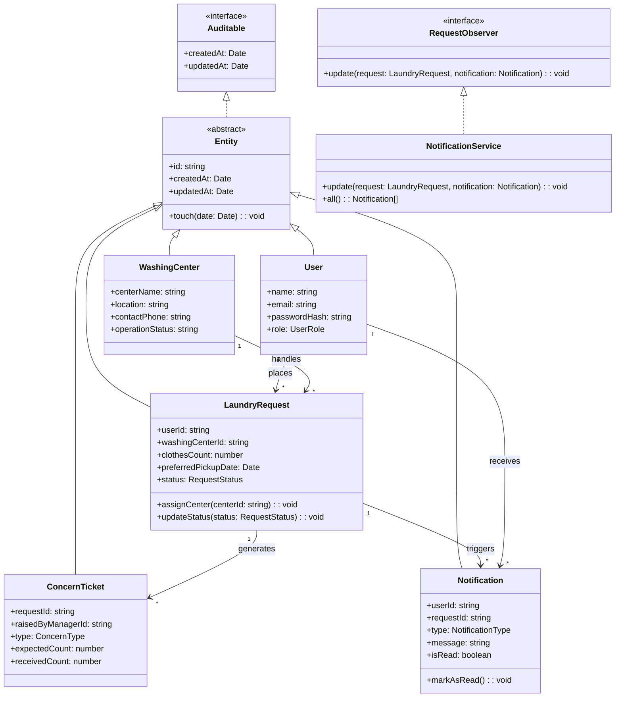

# Class Diagram

The class diagram shows the starting point for the OOP design in `src/`.

```mermaid
classDiagram
    class Auditable {
        <<interface>>
        +createdAt: Date
        +updatedAt: Date
    }

    class RequestObserver {
        <<interface>>
        +update(request: LaundryRequest, notification: Notification): void
    }

    class Entity {
        <<abstract>>
        +id: string
        +createdAt: Date
        +updatedAt: Date
        +touch(date: Date): void
    }

    class User {
        +name: string
        +email: string
        +passwordHash: string
        +role: UserRole
    }

    class WashingCenter {
        +centerName: string
        +location: string
        +contactPhone: string
        +operationStatus: string
    }

    class LaundryRequest {
        +userId: string
        +washingCenterId: string
        +clothesCount: number
        +preferredPickupDate: Date
        +status: RequestStatus
        +assignCenter(centerId: string): void
        +updateStatus(status: RequestStatus): void
    }

    class ConcernTicket {
        +requestId: string
        +raisedByManagerId: string
        +type: ConcernType
        +expectedCount: number
        +receivedCount: number
    }

    class Notification {
        +userId: string
        +requestId: string
        +type: NotificationType
        +message: string
        +isRead: boolean
        +markAsRead(): void
    }

    class NotificationService {
        +update(request: LaundryRequest, notification: Notification): void
        +all(): Notification[]
    }

    Auditable <|.. Entity
    Entity <|-- User
    Entity <|-- WashingCenter
    Entity <|-- LaundryRequest
    Entity <|-- ConcernTicket
    Entity <|-- Notification
    RequestObserver <|.. NotificationService
    User "1" --> "*" LaundryRequest : places
    WashingCenter "1" --> "*" LaundryRequest : handles
    LaundryRequest "1" --> "*" ConcernTicket : generates
    LaundryRequest "1" --> "*" Notification : triggers
    User "1" --> "*" Notification : receives
```
