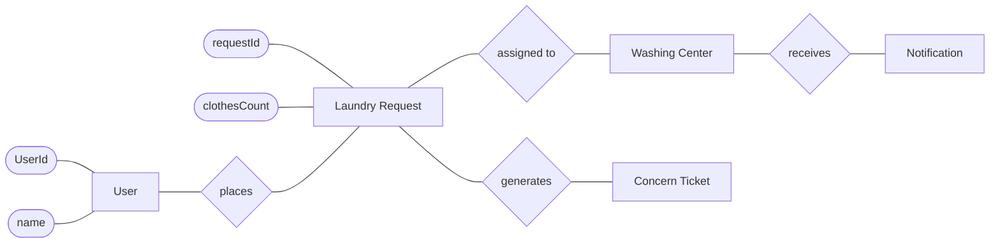

# Conceptual ER Diagram

This version follows the conceptual flow of the third reference image, including the relationship labels shown there.

```mermaid
flowchart LR
    userAttr1([UserId])
    userAttr2([name])
    requestAttr1([requestId])
    requestAttr2([clothesCount])

    user[User]
    request[Laundry Request]
    center[Washing Center]
    ticket[Concern Ticket]
    notification[Notification]

    places{places}
    assigned{assigned to}
    generates{generates}
    receives{receives}

    userAttr1 --- user
    userAttr2 --- user
    requestAttr1 --- request
    requestAttr2 --- request

    user --- places --- request
    request --- assigned --- center
    request --- generates --- ticket
    center --- receives --- notification
```
