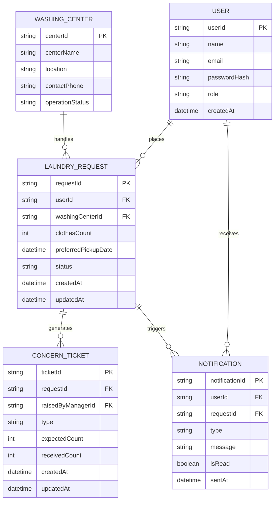

# ER Diagram

The diagram below follows the entity set shown in the reference image and keeps the same core fields and relationships.

```mermaid
erDiagram
    USER {
        string userId PK
        string name
        string email
        string passwordHash
        string role
        datetime createdAt
    }

    WASHING_CENTER {
        string centerId PK
        string centerName
        string location
        string contactPhone
        string operationStatus
    }

    LAUNDRY_REQUEST {
        string requestId PK
        string userId FK
        string washingCenterId FK
        int clothesCount
        datetime preferredPickupDate
        string status
        datetime createdAt
        datetime updatedAt
    }

    CONCERN_TICKET {
        string ticketId PK
        string requestId FK
        string raisedByManagerId FK
        string type
        int expectedCount
        int receivedCount
        datetime createdAt
        datetime updatedAt
    }

    NOTIFICATION {
        string notificationId PK
        string userId FK
        string requestId FK
        string type
        string message
        boolean isRead
        datetime sentAt
    }

    USER ||--o{ LAUNDRY_REQUEST : places
    WASHING_CENTER ||--o{ LAUNDRY_REQUEST : handles
    LAUNDRY_REQUEST ||--o{ CONCERN_TICKET : generates
    USER ||--o{ NOTIFICATION : receives
    LAUNDRY_REQUEST ||--o{ NOTIFICATION : triggers
```
