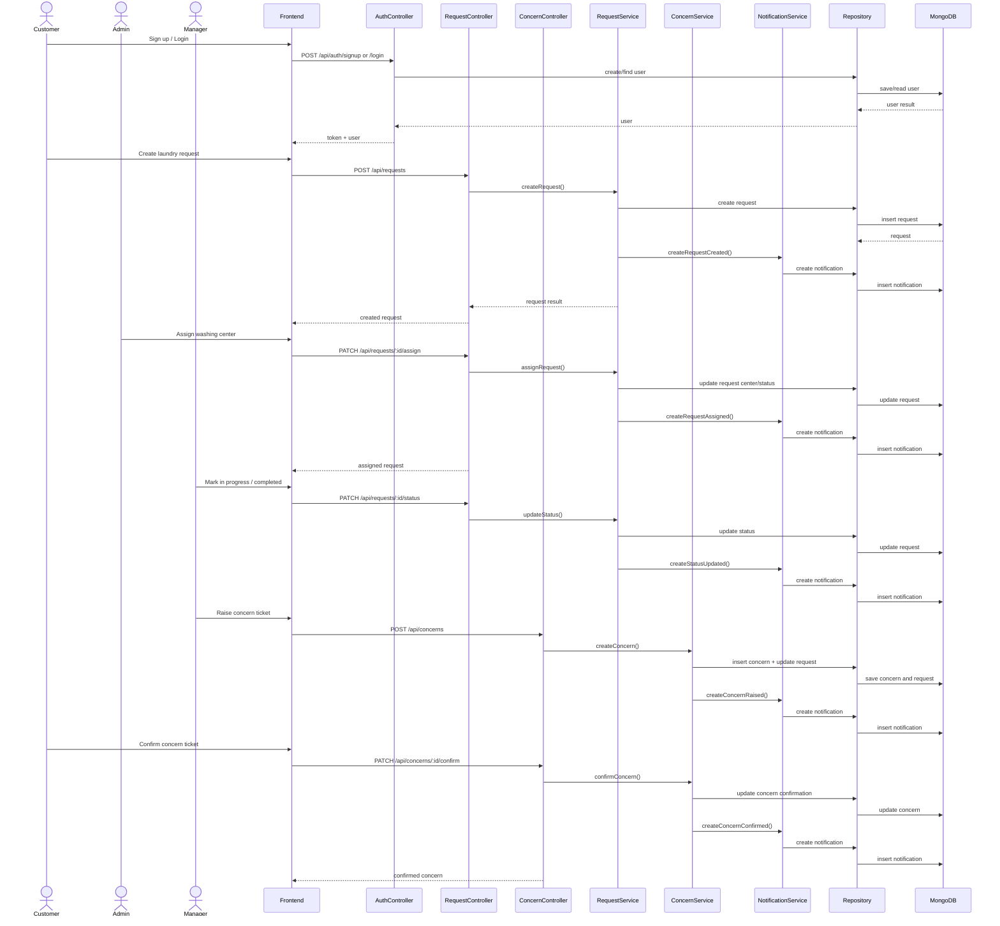

# Sequence Diagram

This sequence diagram captures the major WashFlow workflow from customer request creation through admin assignment, manager processing, concern raising, and customer confirmation.

