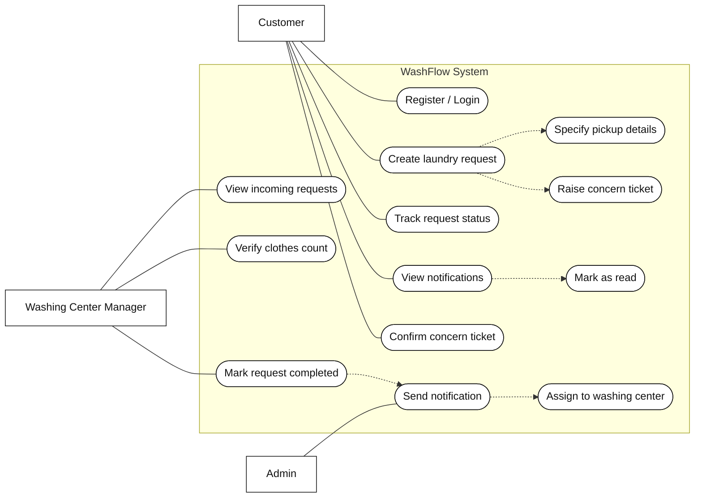

# Use Case Diagram

The use cases mirror the hand-drawn system boundary and actor interactions from the reference sketch.

```mermaid
flowchart LR
    classDef actor fill:#ffffff,stroke:#111111,color:#111111;
    classDef usecase fill:#ffffff,stroke:#111111,color:#111111;

    customer[Customer]:::actor
    manager[Washing Center Manager]:::actor
    admin[Admin]:::actor

    subgraph system[WashFlow System]
        direction TB
        uc1([Register / Login]):::usecase
        uc2([Create laundry request]):::usecase
        uc3([Track request status]):::usecase
        uc4([View notifications]):::usecase
        uc5([Confirm concern ticket]):::usecase
        uc6([View incoming requests]):::usecase
        uc7([Verify clothes count]):::usecase
        uc8([Mark request completed]):::usecase
        uc9([Specify pickup details]):::usecase
        uc10([Raise concern ticket]):::usecase
        uc11([Mark as read]):::usecase
        uc12([Send notification]):::usecase
        uc13([Assign to washing center]):::usecase
    end

    customer --- uc1
    customer --- uc2
    customer --- uc3
    customer --- uc4
    customer --- uc5

    manager --- uc6
    manager --- uc7
    manager --- uc8

    admin --- uc12

    uc2 -.-> uc9
    uc2 -.-> uc10
    uc8 -.-> uc12
    uc12 -.-> uc13
    uc4 -.-> uc11
```
